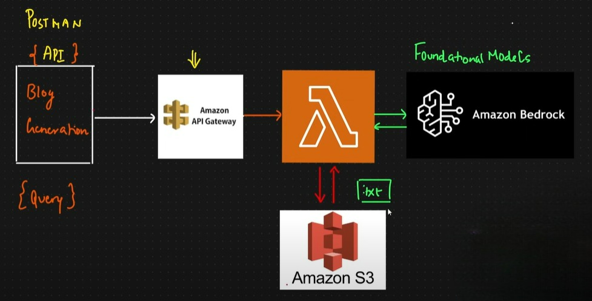

# Generative AI On Cloud (Azure And AWS)
Utilized services from AWS like Amazon LAMBDA, Amazon BedRock, Amazon S3 Bucket, and API Gateway.
Amazon Lambda:
created a function which generates blog of 200-300 words on a given blog topic utilizing the bedrock foundational models.
Amazon S3:
Stored the final generated text into s3 storage.
API Gateway:
This is utilized to trigger the lambda function.

